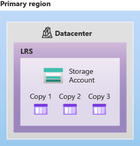

# LRS Vs ZRS Vs GRS Vs #GZRS

## LRS (Locally redundant storage)

- This is the lowest-cost data redundancy option that azure provides.
- Here data is stored in three times in the same data center or same physical location as show in the below Image.
  
- In LRs the write operation returns succesfull when it's written to all the three replicas succesfully.
- If your application stores data that can be easily reconstructed if data loss occurs, you may opt for LRS.

## ZRS (Zone redundant storage)

- ZRS replicates the data synchronously in three availabilty zones. Each availabilty zone had it's separate physical location, networking and cooling.
- A write request to the azure resource which is using ZRS will return successfull, when it comeplets the operation in three availabilty Zones.

## GRS (Geo-Redundant storage)

- It copies your data synchronously three times within a single physical location in the primary region using LRS. It then copies your data asynchronously to a single physical location in the secondary region. Within the secondary region, your data is copied synchronously three times using LRS.

- A write operation is first committed to the primary location and replicated using LRS. The update is then replicated asynchronously to the secondary region. When data is written to the secondary location, it's also replicated within that location using LRS.

[!Images is missing](./Images/GRS.png)

## GZRS (Geo-zone-redundant-storage)

- copies your data synchronously across three Azure availability zones in the primary region using ZRS. It then copies your data asynchronously to a single physical location in the secondary region. Within the secondary region, your data is copied synchronously three times using LRS.

- you can continue to read and write data if an availability zone becomes unavailable or is unrecoverable

[!Images is missing](./Images/GZRS.png)
