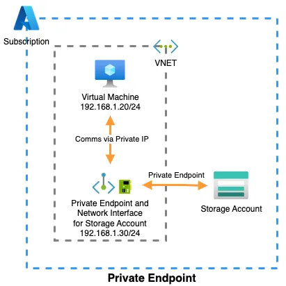
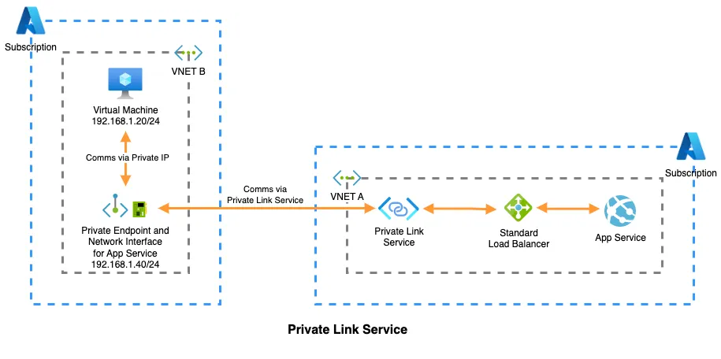
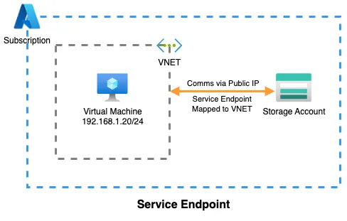

# Networking Fundamentals

## IP address:

An Internet Protocol(IP) address is the unique indentifying number assigned to every device connected to an internet. An IP address definition is a numeric label assigned devices that use the internet to communicate.

Ip address haves two different versions IPv4 and IPv6. There are different types of IP addresses like static IP, Dynamic IP, Public IP, Private IP. The full range of IP address in 0.0.0.0 to 255.255.255.255.

## CIDR

https://cidr.xyz/

- CIDR stands for Classless Inter-Domain Routing. It is an IP address assigning method that improves the efficiency of ip address distribution.
- By using CIDR IP address many unique IP addresses can be designated. CIDR IP address is same as normal IP address except that it ends with slash followed by a number.

  172.200.0.0/16 --> four block --> each - block 8bits...The block size must be of power 2 and equal to the total number of IP addresses.

## Virtual Network

- Azure Virtual Network is a service that provides the fundamental block for creating your private network on azure.
- It enables the azure resources to securely communicate with each other, to internet and to on-premises.
- It's similar to you own private network on data center.

### why virtual network ?

- Communication b/w azure resources.
- Communication to internet, on-prem.
- Filtering of network traffic.
- Routing of network traffic.

## Point-to-site VPN:

Established between your azure network and single computer in client network. Each computer that wants to connect with virtual network must configure this connection. This is usefull if you're just getting started with azure or for developers because it come's with less changes or no changes.

## Site-to-Site VPN

Established b/w your on-premises VPN device and an Azure VPN gateway that's deployed in Azure Virtual Network. This connection b/w on-prem network and azure VPN gateway is sent thorugh a tunnel over the internt.

## Express Route

Established between your network and Azure, through an ExpressRoute partner. This connection is private. Traffic doesn't go over the internet.

## What are ports ?

ports are standardized across all network-connected devices, with each port assigned a number. IP address are used to transfer messages to and from devices, where as port numbers aloow targetting applications on those devices.

Sure! In computer networking, a port is a communication endpoint that processes and exchanges data between different applications or services. Think of it as a door through which data can enter or leave a device. Ports are identified by unique numbers, ranging from 0 to 65535.

**Here's an example to illustrate:**

Let's say you have a computer (Computer A) that hosts a web server, and another computer (Computer B) wants to access a webpage hosted on that server. When Computer B sends a request to Computer A for the webpage, it specifies a destination port number in the request. In this case, the destination port number is typically port 80 for HTTP (Hypertext Transfer Protocol) traffic, which is the standard port for web servers.

Computer A, upon receiving the request, checks the destination port number. Since it's port 80, it knows that the request is for the web server. The web server software running on Computer A listens for incoming requests on port 80. It processes the request, retrieves the requested webpage, and sends it back to Computer B.

## Network Security Group in Azure

- Azure NSG is used to filter out the traffic to and from azure resources in the Vnet.
- NSG will consist of inbound or outbound rules which will allow or deny the traffic.
- You an define the rule by giving 5 tuples Source, source port, Destination, Destination port, protocol.
- You associate a nsg on subnet or NIC(incase of VM), one NSG can be associated with multiple subnets.

## Route Tables

- A route table contains a set of rules, called routes, those routes specify how the packet should be routed in Virtual Network. Route tables are associated with subnets, we define routes by giving destination, it can be a IP address, virtual applicance, virtual network Gateway or internet. If nothing is found the packet can be dropped.

There are two types of route tables
i) System routes.
ii) User-Defined routes.

**i) System routes**

- Whenever you create a VM in Vnet, it can communicate it to internet or other VM's in same Vnet automatically. This is because of System routes.
- System routes control the flow of communication in the following scenarios:
  i) From within the subnet.
  ii) From a subnet to another subnet in same VM.
  iii) From VM's to internet.
  iv) From Vnet to another Vnet with Vnet peering.
  v) from vnet to another vnet through Vnet gateway.

**ii) User-Defined Routes**

- Whenever you create a user-defined route table you can associate it with the subnet. Remember user-defined route tables can only be used while the traffic is leaving the subnet, not when traffic is coming into subnet.
- User-defined routes will override the system routes.
- In most of the cases system routes are sufficient, but in if you want to user virtual appliances like azure firewall, you need to create user-defined routes.
- In the rotue you need to mention the next hop and destination.

## Azure Firewall

- To create firewall we need to have Firewall policy and AzureFirewallSubnet.
- Why we need policy is - We'll define all the rules in the policy and we can re-use these policies for different Vnets. We cannot reuse the firewall for different Vnets, but we can re-use policies for different Vnets. Firewall policy can be created in one region and can be used with different firewalls in different regions.
- Controlling outbound network access is an important part of an overall network security plan, For example, you may want to limit access to web sites.
  Azure firewall can configure:
  a) **Application rules:** that define Full Qualified Domain Name(FQDNs) that can be accessed from a subnet.
  b) **Network rules** that define source address, protcola, destination (same NSG).
  c) **NAT rules** for forwarding the request on particular port of firewall to another IP and port.
- Firewall is a managed, cloud-based network secuirty service that protects your Vnet reosurces.
- It's highly scalabale and unrestricted scalabilty. It can scale up as much as you need to accomadate the network traffic flow, you don't need to budget for your peak traffic. The more it scales, more you'll pay.
- Firewall can've multiple IP addresses.
- Applying FQDN filtering rules. you can limit outbound HTTP and HTTPS, including wildcards.
- you can terminate SSL/TLS in premium tier of firewall.
- integrating with Azure Monitor.
- By default firewall blocks everything.

## Azure Bastion

- Azure Bastion is a fully managed PAAS service that you provision to securely connect to virtual machines via private IP address.
- Bastion provides secure RDP and SSH connection to all the VM's within the Vnet i.e., provisioned.
- It supports manual host scaling(no: of concurrent user), it provides avaialibilty zones in some regions.

## Azure Private link

Azure private link is a set of services designed to establish secure connections to various services in Azure.
It consists of two services

1. Private EndPoint.
2. Private Link Service.

### Private Endpoint

When you activate a private endpoint on storage account which is not belonging to the Vnet, it receives a NIC, with a complete private IP address from the selected Virtual Network. Consequently, resources already residing within the same VNET or connected to it (by means of VNET peering, VPN, ExpressRoute etc.) gain the capability to securely access the Storage Account solely through this private IP address

### Private Link Service

This is useful when two different azure services are in two different Vnets and Vnet peering is not possible due to some issues like Ip address conflicts or other securtiy considerations.
Esentially, it enables you to create a private endpoint for a resource in VnetA for a service hosted in VnetB and made accessible thorugh a standard load balancer.
In essence, the Private Link Service helps allocate a private IP (Private Endpoint) within VNET B for a service that is hosted in VNET A. This configuration enables the services within VNET B to securely establish connections with the service hosted in VNET A using a private IP.

### Service endpoints

They enable a resource within an Azure VNET to establish a more secure and direct connection to another Azure resource, such as a Storage Account.
For example, if a Virtual Machine in a VNET needs to connect to a storage account, only the Virtual Machine will have an internal IP within the VNET.
The storage account itself won’t possess an internal IP in the VNET but will instead be mapped to the same VNET, allowing the Virtual Machine to take a more direct route while still utilizing the public IP of the storage account but without leaving the Azure backbone or traversing the public internet.

