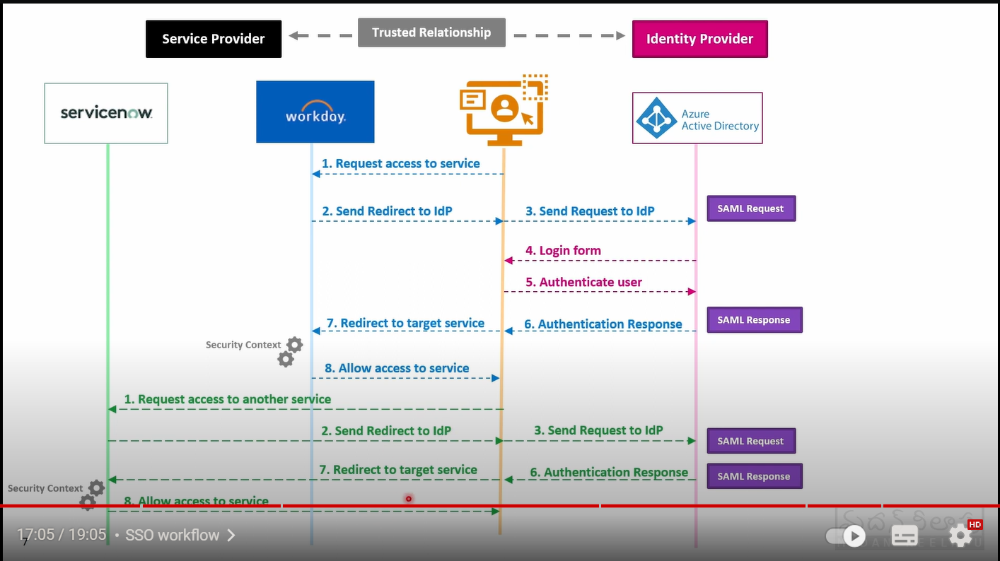

# What is SSO ?

- Single Sign On is an authentication method to allow user to multiple applications using one set of credentials.

## How does this work ?

- First thing is there are two providers here, one is service provider and another is Identity provider.
- There will be Truested relationship b/w Service Provider and Identity provider.
- Service provider is the application which you're using for example service now.
- Identity provider is something like Azure Active Directory or any other active directory.

- When a user try to access servicenow application, the servicenow will say I'm the service provider, I'll only provide the service not the authentication. And servicenow will send a 302 status code redirect URL to our browser which'll redirect to Identitty provider.

- Then our browser will send and SAML request to Identity provider(i.e., Active Directory) then AD will ask the user to enter login credentials or OTP or MFA authentication method to verify the user. If the authentication is succesfull then the AD will start a SSO session, it'll generate a token.

- Now the Identity provider will send a SAML response with 302 status code to browser, then the browser will redirect to Service provider. Then service provider will extract the required information from SAML repsonse like session details(how long session is valid)

- Service provider will now give access to the user.

- Now the user wants to access another application called Ascent.

- User will try to access Ascent, then Ascent will send redirect URL to browser and then browser to Identity provider(AD).

- Now the Identity provider will check whether previous token is still valid or not. If it's valid it won't ask any credentials or MFA, it'll direclty send the SAML response to browser and then to Ascent.

- Now the Ascent extract the required information from SAML response, and give access to user.

This is how SSO works.

See the below Image for better understanding.

