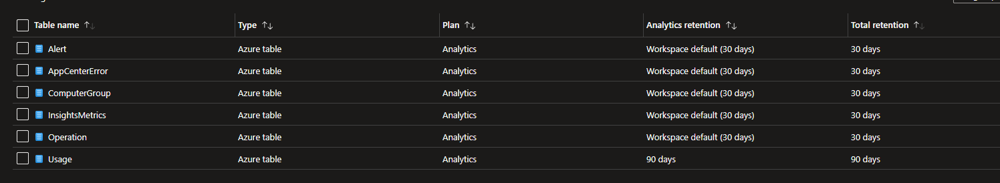

## What's an Event ?

- Anything which is happeninig digitally and recorded as docuements in the form of an record can be reffered to an event. 
- Multiple events generated by a systems are called as logs.

There are different types of logs that are generated by computing systems like endpoint logs, application logs, IOT logs, Security Solution logs, DNS Server logs.

## What's Log Analytics Workspace ?

- Azure LAW is a component which is used for data ingestion from different sources, it's a centrailized repository for storing logs. The logs can be seperated by using tables. This data can be lateron used to analyze abd visuslaize by using other tools.

- Each Log Analytics workspace contains multiple tables in which Azure Monitor Logs stores data you collect.

- Azure Monitor Logs automatically creates tables required to store monitoring data you collect from your Azure environment. You create custom tables to store data you collect from non-Azure resources and applications, based on the data model of the log data you collect and how you want to store and use the data.

## Application of Log Analytics Worksapce

- Azure LAW is the enviornment used by azure monitor for saving the data.
- Enablement of diagnostic settings for azure resource can be done by using azure log analytics workspace.

## Commitment tier in LAW

- you can select the respective commitment tier for your law, by default it's pay-as-you-go but based on your usage patterns you can select 100GB, 200GB tier for getting discounts over your pay-as-you go model.

## Cost

- There is no cost in creation of LAW, you'll only be charged for data ingestion into log analytics workspace.
- you'll also be charged based on the data retention you choose.
- Selecting the region for LAW will help you to save egress cost.

## Daily Cap

- You can set a daily cap for your log analytics workspace, if you're really sure how much amount of data you're going to be ingested.
- Whenever the threshold is reached, the data collection is stopped.
- Whenever daily cap limit is reached a warning is shown on azure portal, as well as an event is generated in operations table of the log analytics workspace.
- Every workspace will have reset time, which will be different from other workspaces, the reset hour is shown in UTC, that cannot be chnaged by us, it's automaitc.

## Default Tables

