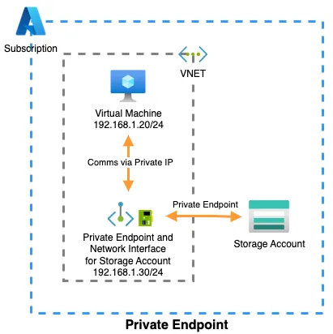
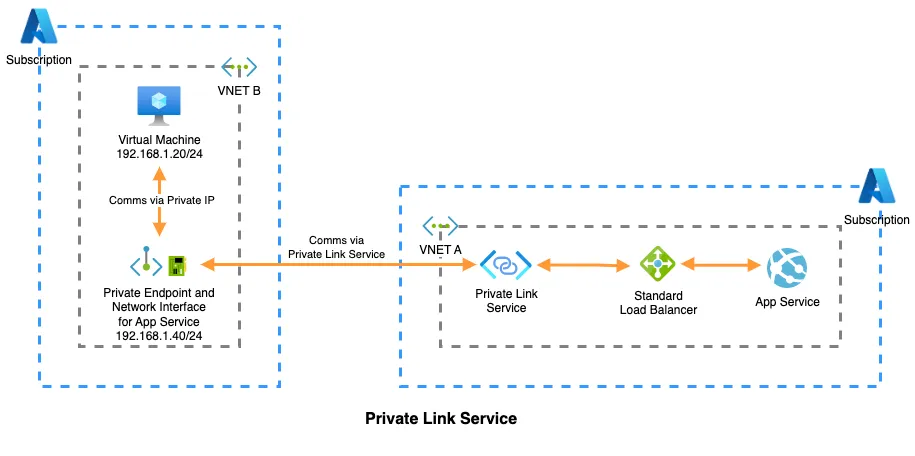
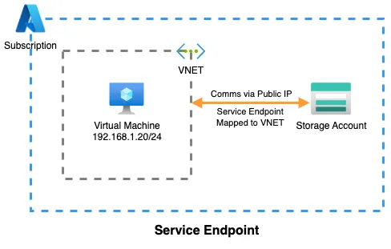

## Azure Private link

Azure private link is a set of services designed to establish secure connections to various services in Azure.
It consists of two services

1. Private EndPoint.
2. Private Link Service.

### Private Endpoint

- When you activate a private endpoint on storage account which is not belonging to the Vnet, it receives a NIC, with a complete private IP address from the selected Virtual Network. Consequently, resources already residing within the same VNET or connected to it (by means of VNET peering, VPN, ExpressRoute etc.) gain the capability to securely access the Storage Account solely through this private IP address

- When you create a private endpoint configure DNS zone correctly to resolve the private endpoint IP address to the fully qualified domain name (FQDN) of the connection string

- Existing Microsoft Azure services might already have a DNS configuration for a public endpoint. This configuration must be overridden to connect using your private endpoint.Existing Microsoft Azure services might already have a DNS configuration for a public endpoint. This configuration must be overridden to connect using your private endpoint.

### Private Link Service

This is useful when two different azure services are in two different Vnets and Vnet peering is not possible due to some issues like Ip address conflicts or other securtiy considerations.
Esentially, it enables you to create a private endpoint for a resource in VnetA for a service hosted in VnetB and made accessible thorugh a standard load balancer.
In essence, the Private Link Service helps allocate a private IP (Private Endpoint) within VNET B for a service that is hosted in VNET A. This configuration enables the services within VNET B to securely establish connections with the service hosted in VNET A using a private IP.

### Service endpoints

They enable a resource within an Azure VNET to establish a more secure and direct connection to another Azure resource, such as a Storage Account.
For example, if a Virtual Machine in a VNET needs to connect to a storage account, only the Virtual Machine will have an internal IP within the VNET.
The storage account itself won’t possess an internal IP in the VNET but will instead be mapped to the same VNET, allowing the Virtual Machine to take a more direct route while still utilizing the public IP of the storage account but without leaving the Azure backbone or traversing the public internet.

