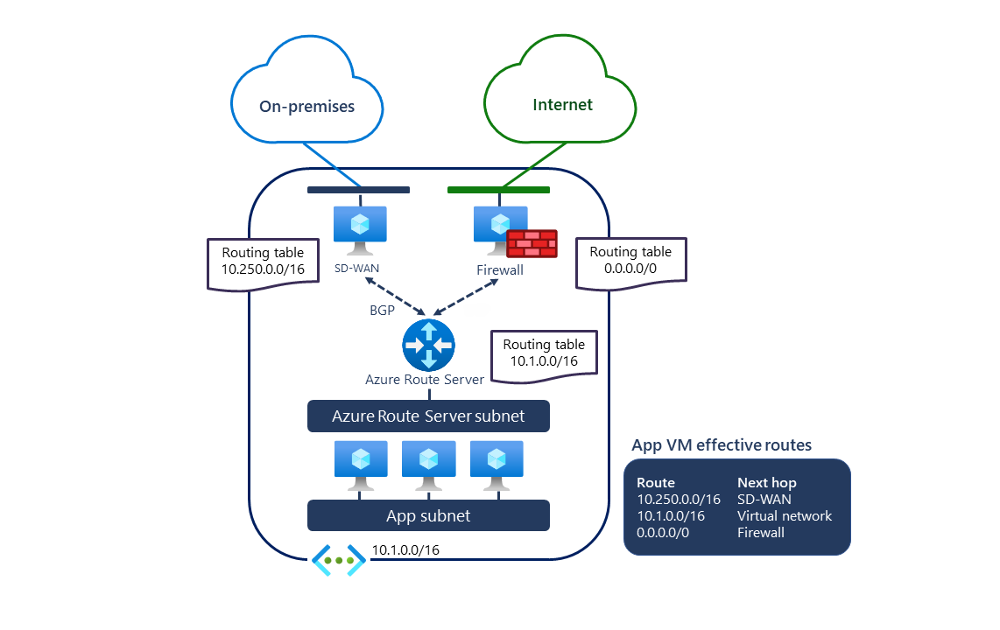

## What is Azure Route Sever ?

Azure Route Server simplifies dynamic routing between your network virtual appliance (NVA) and your Azure virtual network. It allows you to exchange routing information directly through Border Gateway Protocol (BGP) routing protocol between any NVA that supports the BGP routing protocol and the Azure Software Defined Network (SDN) in the virtual network without the need to manually configure or maintain route tables. Azure Route Server is a fully managed service and is configured with high availability.

## How does it work ?

The following diagram illustrates how Azure Route Server works with an SDWAN NVA and a security NVA in a virtual network. Once you establish the BGP peering, Azure Route Server receives an on-premises route (10.250.0.0/16) from the SDWAN appliance and a default route (0.0.0.0/0) from the firewall. These routes are then automatically configured on the VMs in the virtual network. As a result, all traffic destined to the on-premises network is sent to the SDWAN appliance, while all internet-bound traffic is sent to the firewall. In the opposite direction, Azure Route Server sends the virtual network address (10.1.0.0/16) to both NVAs. The SDWAN appliance can propagate it further to the on-premises network.

- Azure Route Server is highly available across the zones.

### **What is BGP (Border Gateway Protocol)?**

**BGP (Border Gateway Protocol)** is a **dynamic routing protocol** used to exchange routing information between different networks, particularly across the internet and large private networks.

🛠 **Think of BGP as the "postal service" of the internet**—it decides the best route for data to travel between different networks (Autonomous Systems).

---

## **Key Concepts of BGP**

### **1️⃣ BGP Establishes Peering Between Networks**

🔹 BGP is used to exchange routes between **two or more networks** (called **Autonomous Systems, AS**).  
🔹 It establishes **BGP peering** using **TCP port 179**.  
🔹 Peers are called **BGP neighbors**.

✅ Example:

- Your **on-premises network (AS 65001)** connects to **Azure (AS 12076)** via **BGP peering**.

### **2️⃣ BGP Selects the Best Path**

🔹 If there are multiple routes to the same destination, **BGP selects the best path** based on metrics like:

- **Shortest AS path** (fewer network hops)
- **Lowest administrative cost**
- **Highest preference by network policies**

### **3️⃣ BGP Supports Route Advertisement**

🔹 Instead of **manually configuring static routes**, BGP **dynamically updates routes** when a new network is added or removed.  
🔹 It helps in **failover scenarios**—if one path fails, traffic is rerouted automatically.

---

## **How BGP Works in Azure?**

🔹 Azure uses **BGP in ExpressRoute, VPN Gateway, and Route Server** to dynamically exchange routes.  
🔹 With **Azure Route Server**, BGP allows NVAs to share routes **without manually managing route tables**.

📌 **Example Use Case:**  
Imagine you have:

- **On-premises network (10.250.0.0/16)** connected via **ExpressRoute**
- **Azure Virtual Network (10.1.0.0/16)** with a firewall
- BGP automatically sends:
  - **On-premises routes to Azure**
  - **Azure VNet routes to On-premises**

🔹 **Result?** No need for manual routing changes—BGP dynamically manages everything! 🚀

---

### **Why is BGP Important?**

✅ **Scalability** – Handles large networks efficiently.  
✅ **High Availability** – If one path fails, BGP finds an alternative.  
✅ **Dynamic Routing** – Updates routes automatically.  
✅ **Internet & Cloud Routing** – Used by ISPs and cloud providers like Azure & AWS.
