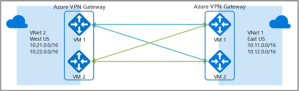

## VPN Gateway

VPNs typically are deployed to connect two or more trusted private networks to one another over an untrusted network such as the internet. Traffic is encrypted while traveling over the untrusted network to prevent a third-party from eavesdropping on the network communication.

When you're planning a VPN gateway, there are three architectures to consider:

- Point to site over the internet.
- Site to site over the internet.
- Site to site over a dedicated network, such as Azure ExpressRoute.

## Gateway Subnet in Azure

A Gateway Subnet is required for VPN Gateways in Azure. It contains the IP addresses that the Virtual Network Gateway VMs and services use.

**Key Points:**

- The subnet must be named GatewaySubnet.
- This subnet is only for the Virtual Network Gateway—no other resources should be deployed here.
- When creating a VPN Gateway, Azure automatically deploys gateway VMs in this subnet.
- The subnet size determines how many IP addresses are available for the gateway.
  - Minimum size: /29
  - Recommended size: /27 (to allow future scaling or ExpressRoute coexistence).

## High availability options for VPN connections

To provide better availability for your VPN connections, there are a few options available:

- VPN Gateway redundancy (Active-standby).
- Multiple on-premises VPN devices.
- Active-active Azure VPN gateway.
- Combination of both.

## VPN Gateway redundancy

Azure VPN gateway has two instances (active-standby). During maintenance or failures, the standby takes over automatically.

**Downtime:**

- **Planned:** 10–15 sec
- **Unplanned:** 1–3 min  
  P2S connections are disconnected, and users must reconnect.

## Multiple on-premises VPN devices

This configuration provides multiple active tunnels from the same Azure VPN gateway to your on-premises devices in the same location. There are some requirements and constraints:

- You need to create multiple S2S VPN connections from your VPN devices to Azure. When you connect multiple VPN devices from the same on-premises network to Azure, you need to create one local network gateway for each VPN device, and one connection from your Azure VPN gateway to each local network gateway.
- The local network gateways corresponding to your VPN devices must have unique public IP addresses in the GatewayIpAddress property.
- BGP is required for this configuration. Each local network gateway representing a VPN device must have a unique BGP peer IP address specified in the BgpPeerIpAddress property.
- You should use BGP to advertise the same prefixes of the same on-premises network prefixes to your Azure VPN gateway, and the traffic is forwarded through these tunnels simultaneously.
- You must use Equal-cost multi-path routing (ECMP).
- Each connection is counted against the maximum number of tunnels for your Azure VPN gateway, 10 for Basic and Standard SKUs, and 30 for HighPerformance SKU.

In this configuration, the Azure VPN gateway is still in active-standby mode, so the same failover behavior and brief interruption occurs. But this setup guards against failures or interruptions on your on-premises network and VPN devices.

## Active-active VPN gateways

- Each Azure VPN gateway instance has a **unique public IP** and establishes an **IPsec/IKE S2S VPN tunnel** to the on-premises VPN device.
- **Two tunnels** exist simultaneously, ensuring high availability.
- Traffic from Azure to on-premises is **routed through both tunnels**, though the on-premises VPN may prefer one.
- For **single TCP/UDP flows**, Azure tries to use the same tunnel, but the on-premises network may use different ones.
- During **planned maintenance or failure**, one tunnel disconnects, and the VPN device automatically removes or updates routes to switch traffic to the active tunnel.
- **Failover is automatic** on the Azure side, ensuring minimal disruption.

## Dual-redundancy: active-active VPN gateways for both Azure and on-premises networks

Here you create and set up the Azure VPN gateway in an active-active configuration and create two local network gateways and two connections for your two on-premises VPN devices. The result is a full mesh connectivity of 4 IPsec tunnels between your Azure virtual network and your on-premises network.

All gateways and tunnels are active from the Azure side, so the traffic is spread among all four tunnels simultaneously. By spreading the traffic, you may see slightly better throughput over the IPsec tunnels, the primary goal of this configuration is for high availability. And due to the statistical nature of the spreading, it's difficult to provide the measurement on how different application traffic conditions affects the aggregate throughput.

This topology requires two local network gateways and two connections to support the pair of on-premises VPN devices, and BGP is required to allow the two connections to the same on-premises network.

## Highly Available VNet-to-VNet

The same active-active configuration can also apply to Azure VNet-to-VNet connections. You can create active-active VPN gateways for both virtual networks, and connect them together to form the same full mesh connectivity of four tunnels between the two VNets.

Even though the same topology for cross-premises connectivity requires two connections, the VNet-to-VNet topology only needs one connection for each gateway. Additionally, BGP is optional unless transit routing over the VNet-to-VNet connection is required.

## Process of connecting site-to-site

## 🔹 Site-to-Site VPN in Azure (On-Prem ↔ Azure)

A **Site-to-Site VPN** connects your on-premises network (like your data center, office, etc.) to Azure Virtual Network (VNet) using a **VPN Gateway** over the internet.

---

### **Step 1: Prerequisites**

1. **On-premises environment:**

   * A VPN device (Firewall, Router, e.g., Cisco ASA, Fortinet, pfSense, etc.)
   * Public IP for the VPN device (static, not NAT).

2. **Azure:**

   * An Azure subscription.
   * A Virtual Network (VNet) created in Azure with proper address space.
   * No overlap between Azure VNet IP range and on-prem network IP range.

---

### **Step 2: Create a Virtual Network in Azure**

1. Go to **Azure Portal → Create a Virtual Network**.
2. Define:

   * Address space (e.g., `10.1.0.0/16`).
   * Subnets (create at least one "GatewaySubnet").

   ⚠️ **Important**: The subnet for the gateway must be named `GatewaySubnet`. Example: `10.1.255.0/27`.

---

### **Step 3: Create the VPN Gateway**

1. Go to **Create a Resource → Virtual Network Gateway**.
2. Provide:

   * Name: e.g., `MyVPNGateway`.
   * Region: Same as your VNet.
   * Gateway Type: **VPN**.
   * VPN Type: **Route-based** (preferred for most scenarios).
   * SKU: Choose based on throughput needs (e.g., VpnGw1).
   * Public IP: Create a new one (Azure assigns a static IP).

👉 Deployment may take **30–45 mins**.

---

### **Step 4: Create Local Network Gateway (represents On-prem)**

1. Go to **Create Local Network Gateway**.
2. Enter:

   * Name: `OnPrem-LNG`.
   * On-prem VPN device **public IP**.
   * Address space(s): On-premises LAN IP ranges (e.g., `192.168.0.0/16`).

---

### **Step 5: Create the VPN Connection**

1. Go to **Virtual Network Gateway → Connections → Add**.
2. Choose:

   * Connection Type: **Site-to-Site (IPsec)**.
   * Virtual Network Gateway: your Azure gateway.
   * Local Network Gateway: your on-premises gateway.
   * Shared Key (PSK): Set a pre-shared key (e.g., `MySecretKey123`).

---

### **Step 6: Configure On-Prem VPN Device**

On your firewall/router:

1. Create an **IPsec tunnel** to Azure VPN Gateway Public IP.
2. Use the same:

   * Shared key (PSK).
   * Encryption (IPsec/IKE settings).
   * Local network = On-prem subnet.
   * Remote network = Azure VNet subnet.

Azure supports **IKEv2** (IKEv1 also works but v2 is recommended).

---

### **Step 7: Test the Connection**

* In Azure → **Virtual Network Gateway → Connections**, status should show **"Connected"**.
* Try to ping or RDP between an Azure VM and an on-prem server.

---
