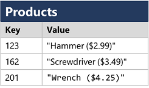
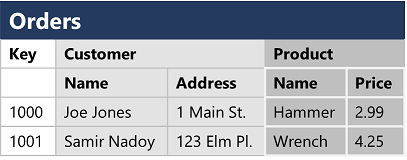

# Databses

A database is a central system, where data can be stored and queried.

## Relational Database

Relational databases are the type of databases which are used to store and query strucutred data. Here the data is orgnaized in the form of tables i.e., rows and columns. The relationship b/w tables is established using keys such as primary key of one table is linked to foreign key of another table to create the relationship b/w tables. These relationships allow data to be distributed across multiple tables while ensuring consistency and integrity.

## Non-Relational Database

Non-relational database won't apply relational schema to the data.

There are four common types of Non-relational database commonly in use:

**Key-value database:** In which each record consists of a unique key and an associated value, which can be in any format.

**Document Database:** Here it is key-value database, when value is JSON Document.

**Column amily Database:** which store tabular data comprising rows and columns, but you can divide the columns into groups known as column-families. Each column family holds a set of columns that are logically related together.

**Graph databases** which store entities as nodes with links to define relationships between them.
