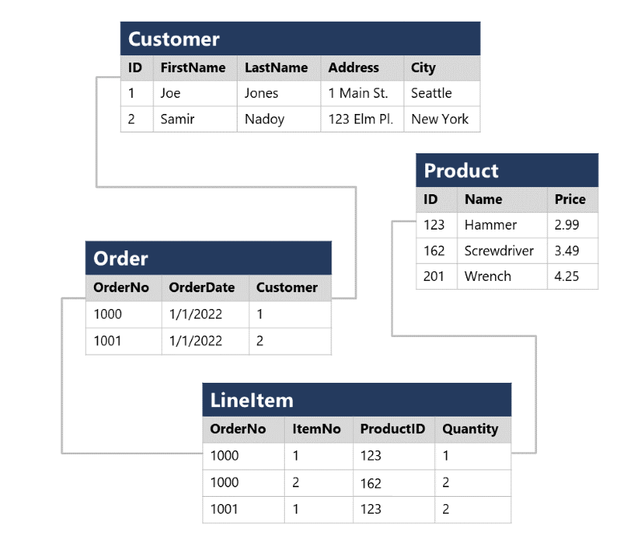

# Introduction to Relational Data

- In early stages of computing systems, every application stored data in it's own unique structure. If developers want to build an application to use that data, they need to know more about data structure.
- These data structures are inefficient, hard to maitain and hard to optimize for good application performance.
- To solve this problem relational database is designed, where it provides the structured way of representing and querying the data.
- The main advantage of relational database is Tables, which are the most efficient of intuitive, storing and retriving information.
- Relational tables are format for strucutred data, and each row in a table has the same columns; though in somecases, not all columns need to have value, some can be NULL, like MiddleNAme e.t.c.

entity - table.
instance - row.
attribute - column.

---

# Normalization

- Normalization is a term used by database professionals to reduce the data duplication and enforced the data integrity. There are many complex rules that define the process of refactoring data into various levels (or forms) of normalization, a simple definition for practical purposes is

- Seperate each entity into it's own table.
- Seperate each discrete attribute into each own column.
- Use Primary Key to uniquely identify each rwo.
- USe foreign key colums to kink entities.

**Example** - See the below un-normalized data

In the above image if you see the product and cusotmer details are duplicated for each order. The product name and price are in same column.

Now let's look at the way how normalization changes the way of storing the data

- Each entity has been seperated into it's own table and each attriubute of entities are seperated into it's own column.
- Each row or instance had own unique ID which is primary key.
- Where one entity referencing another will sotre primary key as foreign key.

---

# SQL

- Structured Query Language is the language used to communicate with relational databases. You can use SL statements like SELECT, UPDATE, INSERT, CREATE, DROP and DELETE to perform almost all operations related to databases.

## SQL Statements types

- Data Definition Language(DDL)
- Data Control Language(DCL)
- Data Manipulation Language(DML)
